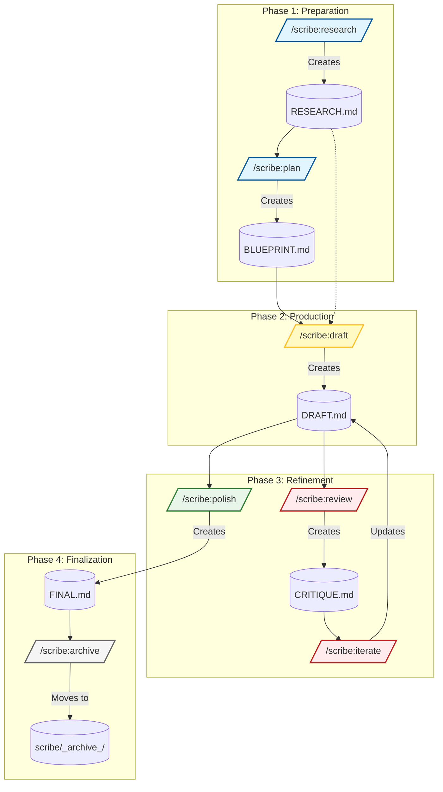

# Scribe Commands Extension for Gemini CLI

<p align="center">
  
</p>

An AI-powered extension for [Gemini CLI](https://github.com/google-gemini/gemini-cli) that facilitates a professional, multi-stage documentation workflow from research to final polish.

## Workflow Diagram



## The Scribe Workflow: A Quality Control Loop

Scribe operates on a structured, file-based workflow that mimics a professional editorial process. Each command performs a specific task and creates a specific file, allowing you to review and control every stage of document creation.

1.  **Research (`/scribe:research`):** Gathers foundational knowledge and creates `RESEARCH.md`.
2.  **Plan (`/scribe:plan`):** Creates a structured outline in `BLUEPRINT.md`.
3.  **Draft (`/scribe:draft`):** Writes the first version of the document into `DRAFT.md`.
4.  **Review (`/scribe:review`):** Critiques the draft from a specific perspective and creates `CRITIQUE.md`.
5.  **Iterate (`/scribe:iterate`):** Applies your chosen fixes from the critique to the `DRAFT.md`.
6.  **Polish (`/scribe:polish`):** Performs a final grammar and style check, creating `FINAL.md`.

## Ideal Use Cases

Scribe is designed for high-stakes, long-form content where structure and accuracy are paramount.

### 📖 Technical Books
*   **Why:** Maintains consistency across hundreds of pages.
*   **Strategy:** Treat each chapter as a separate Scribe project (e.g., `scribe/ch01-intro`). This keeps the context focused while a global `styleguide.md` ensures a unified voice across all chapters.
*   **Key Feature:** Use `/scribe:review --lens=tech` to specifically audit code snippets and technical claims separate from prose editing.

### 📄 Whitepapers & RFCs
*   **Why:** Requires persuasive authority and bulletproof logic.
*   **Strategy:** Use the **Research** phase to ground arguments in data, preventing hallucinations.
*   **Key Feature:** Use `/scribe:review --lens=devil` to simulate a skeptical stakeholder, tearing down weak arguments before you publish.

### 🎯 Product Requirement Documents (PRDs)
*   **Why:** PRDs are contracts between teams; ambiguity causes bugs.
*   **Strategy:** Use `/scribe:plan` to enforce standard sections (Non-Goals, Success Metrics) that are often skipped.
*   **Key Feature:** Use `/scribe:review --lens=devil` to hunt for edge cases and vague requirements before engineering sees the doc.

### 📝 Complex Engineering Documentation
*   **Why:** "Chatting" a complex doc into existence often leads to structural mess.
*   **Strategy:** The **Plan** phase (`BLUEPRINT.md`) forces you to agree on the document's architecture before a single sentence is written.

## Available Commands

| Status             | Command          | Purpose                                                       | User Mental Model                                     |
| :----------------- | :--------------- | :------------------------------------------------------------ | :---------------------------------------------------- |
| :white_check_mark: | `/scribe:status`   | Checks the current workflow state and suggests the next step. | "Where was I? What should I do next?"                 |
| :white_check_mark: | `/scribe:research` | Compiles a research dossier on a topic.                       | "I need foundational knowledge on a new subject."     |
| :white_check_mark: | `/scribe:plan`     | Creates a structured `BLUEPRINT.md` from a topic.             | "Help me think. I need to structure my idea."         |
| :white_check_mark: | `/scribe:draft`    | Writes the first `DRAFT.md` from the blueprint.               | "I have an outline and I'm ready for the full text."      |
| :white_check_mark: | `/scribe:review`   | Critiques the draft and creates a `CRITIQUE.md` report.       | "Check my work for logical flaws or missed details."  |
| :white_check_mark: | `/scribe:iterate`  | Applies specific feedback from the critique to the draft.     | "Fix the specific issues I tell you to."               |
| :construction:     | `/scribe:polish`   | Performs a final grammar and style check.                     | "Make this text sound professional and read better." |

## Enforcing Consistency with a Style Guide

To ensure all documents have a consistent voice, tone, and format, you can create a `styleguide.md` file in your project root.

If Scribe finds this file, it will strictly adhere to the rules defined within it during the `draft`, `iterate`, and `polish` phases. An example `styleguide.md` is included with the extension to get you started.

## Prerequisites

Install the [Gemini CLI](https://geminicli.com/docs/getting-started/installation).

**Learn more about** [Gemini CLI Extensions](https://geminicli.com/docs/extensions/)!

## Extension Installation

From your command line:

```bash
gemini extensions install https://github.com/sapientcoffee/scribe
```

## Extension Validation

Validate the extension from the command line:

```bash
gemini extensions validate
```
