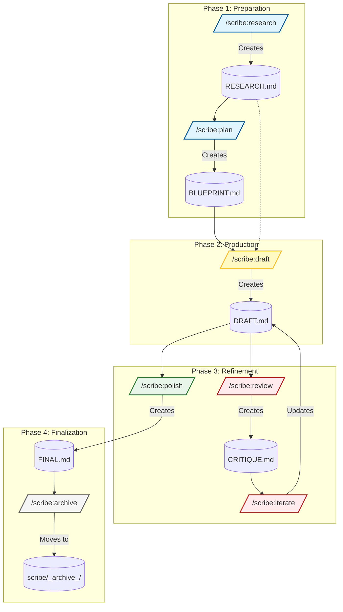
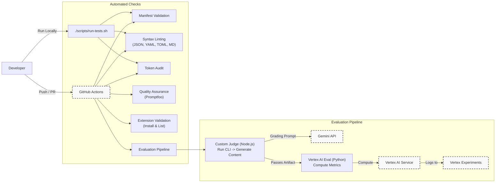

# Scribe Commands Extension for Gemini CLI

<p align="center">
  
</p>

An AI-powered extension for [Gemini CLI](https://github.com/google-gemini/gemini-cli) that facilitates a professional, multi-stage documentation workflow from research to final polish.

> **Read the deep-dive blog post:** [Building Scribe: Spec-Driven Documentation in the Terminal](https://sapient.coffee/posts/2025/scribe-gemini-cli-extension/)

## Workflow Diagram



## The Scribe Workflow: A Quality Control Loop

Scribe operates on a structured, file-based workflow that mimics a professional editorial process. Each command performs a specific task and creates a specific file, allowing you to review and control every stage of document creation.

1. **Research (`/scribe:research`):** Gathers foundational knowledge and creates `RESEARCH.md`.
2. **Plan (`/scribe:plan`):** Creates a structured outline in `BLUEPRINT.md`.
3. **Draft (`/scribe:draft`):** Writes the first version of the document into `DRAFT.md`.
4. **Review (`/scribe:review`):** Critiques the draft from a specific perspective and creates `CRITIQUE.md`.
5. **Iterate (`/scribe:iterate`):** Applies your chosen fixes from the critique to the `DRAFT.md`.
6. **Polish (`/scribe:polish`):** Performs a final grammar and style check, creating `FINAL.md`.

## Ideal Use Cases

Scribe is designed for high-stakes, long-form content where structure and accuracy are paramount.

### 📖 Technical Books

* **Why:** Maintains consistency across hundreds of pages.
* **Strategy:** Treat each chapter as a separate Scribe project (e.g., `scribe/ch01-intro`). This keeps the context focused while a global `styleguide.md` ensures a unified voice across all chapters.
* **Key Feature:** Use `/scribe:review --lens=tech` to specifically audit code snippets and technical claims separate from prose editing.

### 📄 Whitepapers & RFCs

* **Why:** Requires persuasive authority and bulletproof logic.
* **Strategy:** Use the **Research** phase to ground arguments in data, preventing hallucinations.
* **Key Feature:** Use `/scribe:review --lens=devil` to simulate a skeptical stakeholder, tearing down weak arguments before you publish.

### 🎯 Product Requirement Documents (PRDs)

* **Why:** PRDs are contracts between teams; ambiguity causes bugs.
* **Strategy:** Use `/scribe:plan` to enforce standard sections (Non-Goals, Success Metrics) that are often skipped.
* **Key Feature:** Use `/scribe:review --lens=devil` to hunt for edge cases and vague requirements before engineering sees the doc.

### 📝 Complex Engineering Documentation

* **Why:** "Chatting" a complex doc into existence often leads to structural mess.
* **Strategy:** The **Plan** phase (`BLUEPRINT.md`) forces you to agree on the document's architecture before a single sentence is written.

## Available Commands

| Status             | Command          | Purpose                                                       | User Mental Model                                     |
| :----------------- | :--------------- | :------------------------------------------------------------ | :---------------------------------------------------- |
| :white_check_mark: | `/scribe:status`   | Checks the current workflow state and suggests the next step. | "Where was I? What should I do next?"                 |
| :white_check_mark: | `/scribe:research` | Compiles a research dossier on a topic.                       | "I need foundational knowledge on a new subject."     |
| :white_check_mark: | `/scribe:plan`     | Creates a structured `BLUEPRINT.md` from a topic.             | "Help me think. I need to structure my idea."         |
| :white_check_mark: | `/scribe:draft`    | Writes the first `DRAFT.md` from the blueprint.               | "I have an outline and I'm ready for the full text."      |
| :white_check_mark: | `/scribe:review`   | Critiques the draft and creates a `CRITIQUE.md` report.       | "Check my work for logical flaws or missed details."  |
| :white_check_mark: | `/scribe:iterate`  | Applies specific feedback from the critique to the draft.     | "Fix the specific issues I tell you to."               |
| :construction:     | `/scribe:polish`   | Performs a final grammar and style check.                     | "Make this text sound professional and read better." |

## Enforcing Consistency with a Style Guide

To ensure all documents have a consistent voice, tone, and format, you can create a `styleguide.md` file in your project root.

If Scribe finds this file, it will strictly adhere to the rules defined within it during the `draft`, `iterate`, and `polish` phases. An example `styleguide.md` is included with the extension to get you started.

## Prerequisites

Install the [Gemini CLI](https://geminicli.com/docs/getting-started/installation).

**Learn more about** [Gemini CLI Extensions](https://geminicli.com/docs/extensions/)!

## Extension Installation

From your command line:

```bash
gemini extensions install https://github.com/sapientcoffee/scribe
```

## Extension Validation & Testing

We maintain high quality standards for this extension using automated linting and validation tests.



### Running Tests Locally

To ensure your changes are valid before pushing, you can run the local test script:

```bash
npm test
```

This script checks for:
1. **JSON Syntax:** Validates `gemini-extension.json` and other JSON files.
2. **Markdown Style:** Checks all `.md` files against our style guide.
3. **TOML Validity:** Ensures command definitions in `commands/` are valid TOML.
4. **YAML Syntax:** Validates GitHub Actions workflow files.

### Semantic & Matrix Testing

We use `promptfoo` to perform deep semantic testing of the extension's output.

*   **Quality Check:** `npm run test:eval`
    *   Tests if the "Architect" sounds like an architect.
    *   Verifies formatting constraints (e.g., line length).
*   **Model Matrix:** `npm run test:models`
    *   Runs the same tests against multiple Gemini models (e.g., Gemini 3 Pro vs Gemini 2.0 Flash) side-by-side.
    *   Useful for ensuring future-proofing and regression testing across model versions.

### CI/CD Pipeline

### CI/CD Pipeline

Every Pull Request is automatically tested via GitHub Actions to verify:
*   **Linting:** All file formats (JSON, Markdown, YAML, TOML) are syntactically correct.
*   **Installation:** The extension installs successfully in a fresh environment.
*   **Validation:** The extension manifest is valid according to the Gemini CLI schema.
*   **Token Audit:** Estimates token usage for each command to ensure prompts remain efficient (< 4500 tokens).

### CI Configuration

To enable the Token Audit in your fork or repository, you must provide a Gemini API Key.

1.  Get an API Key from [Google AI Studio](https://aistudio.google.com/).
2.  Go to your GitHub Repository **Settings** > **Secrets and variables** > **Actions**.
3.  Create a **New repository secret** named `GEMINI_API_KEY`.
4.  Paste your API key value.

Without this key, the CI workflow will fail.

## Evaluation & Quality Assurance

To ensure the quality of the Scribe extension's outputs, we have implemented multiple evaluation strategies.

### 1. Custom Judge Script (Node.js)
This script runs an end-to-end test of the CLI commands and uses a "Judge" LLM (Gemini 3 Pro) to grade the generated content.

*   **Usage:** `node scripts/eval-custom.js`
*   **What it does:**
    1.  Executes `/scribe:research` and `/scribe:plan` via the Gemini CLI (headless mode).
    2.  Verifies the creation of `BLUEPRINT.md`.
    3.  Sends the blueprint to Gemini 3 Pro with a grading rubric (Structure, Completeness, Formatting).
    4.  Passes only if the score is high and the reasoning is positive.

### 2. Vertex AI Evaluation (Enterprise)
For more robust, metrics-based evaluation, we support the Vertex AI Evaluation Service. This step runs automatically in CI/CD if Google Cloud credentials are provided.

*   **Usage:** `source .venv/bin/activate && python scripts/eval_vertex.py`
*   **Requirements:**
    1.  Google Cloud Project with **Vertex AI API** enabled.
    2.  Service Account with `Vertex AI User` role.
    3.  Python dependencies installed from `requirements.txt`.
*   **Metrics:**
    *   **Coherence:** Auto-rated by a model (Score 1-5).
    *   **Safety:** Checked against safety filters.
    *   **ROUGE:** Structural similarity against a "Golden Reference" (from `eval_dataset.jsonl`).
*   **CI Configuration:**
    *   Add `GCP_CREDENTIALS` (Service Account JSON Key) to GitHub Secrets.
    *   Add `GEMINI_API_KEY` to GitHub Secrets.

### 3. Golden Dataset
We maintain a "Golden Dataset" in `eval_dataset.jsonl` containing high-quality prompt/response pairs. This can be uploaded to the Vertex AI Console to run large-scale batch evaluations and track quality trends over time.
